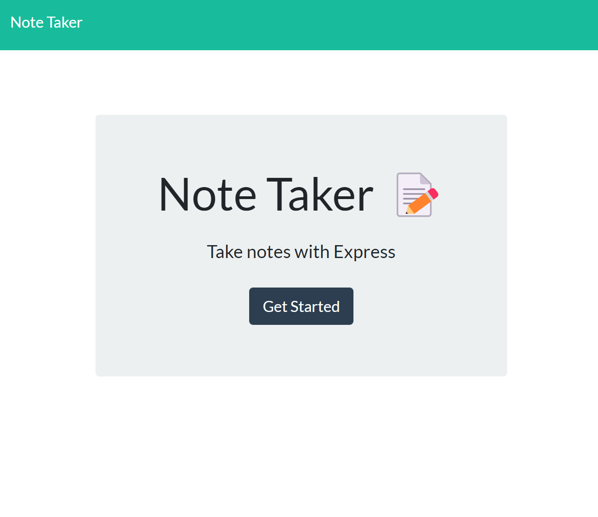
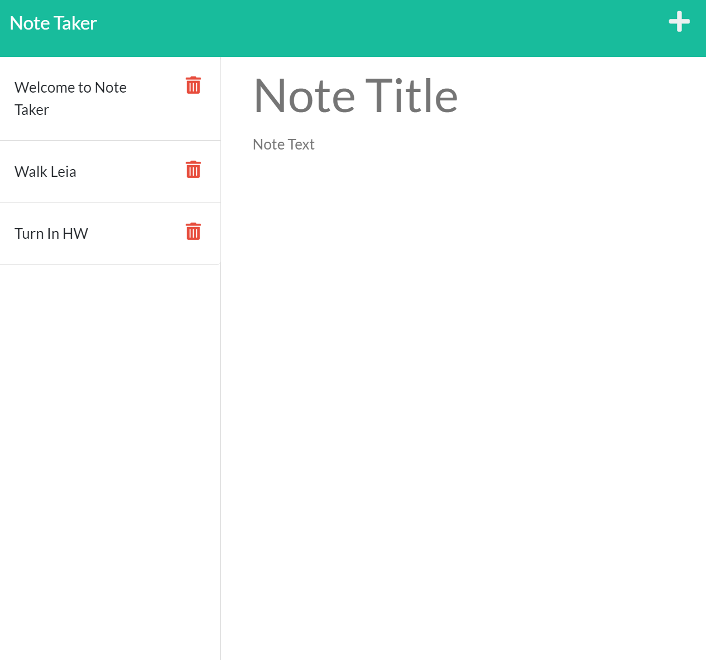

# Note Taker📓

 

Welcome😊👋

## Description📝

This application was created to allow a user to write and save tasks as notes in order to keep their thoughts organized. The application will be depolyed with the use of Heroku CLI.

## Heroku Deployed Application

http://afternoon-ocean-64485.herokuapp.com/notes

## Installation

In order to run this application you must have Heroku installed on your machine. To install the Heroku CLI on Windows, download the <a href="https://devcenter.heroku.com/articles/heroku-cli#download-and-install" target="_blank">64-bit installer</a> for Windows. To confirm you have Heroku installed, type <code>heroku --version</code> or <code>heroku -V</code> into the command line.

## Visuals

## Credit

https://coding-boot-camp.github.io/full-stack/heroku/how-to-install-the-heroku-cli

https://expressjs.com/en/guide/routing.html

## License 🔑

MIT License

Copyright (c) [2022] [Gassan-Bundakji]

Permission is hereby granted, free of charge, to any person obtaining a copy of this software and associated documentation files (the "Software"), to deal in the Software without restriction, including without limitation the rights to use, copy, modify, merge, publish, distribute, sublicense, and/or sell copies of the Software, and to permit persons to whom the Software is furnished to do so, subject to the following conditions:

The above copyright notice and this permission notice shall be included in all copies or substantial portions of the Software.

THE SOFTWARE IS PROVIDED "AS IS", WITHOUT WARRANTY OF ANY KIND, EXPRESS OR IMPLIED, INCLUDING BUT NOT LIMITED TO THE WARRANTIES OF MERCHANTABILITY, FITNESS FOR A PARTICULAR PURPOSE AND NONINFRINGEMENT. IN NO EVENT SHALL THE AUTHORS OR COPYRIGHT HOLDERS BE LIABLE FOR ANY CLAIM, DAMAGES OR OTHER LIABILITY, WHETHER IN AN ACTION OF CONTRACT, TORT OR OTHERWISE, ARISING FROM, OUT OF OR IN CONNECTION WITH THE SOFTWARE OR THE USE OR OTHER DEALINGS IN THE SOFTWARE.
